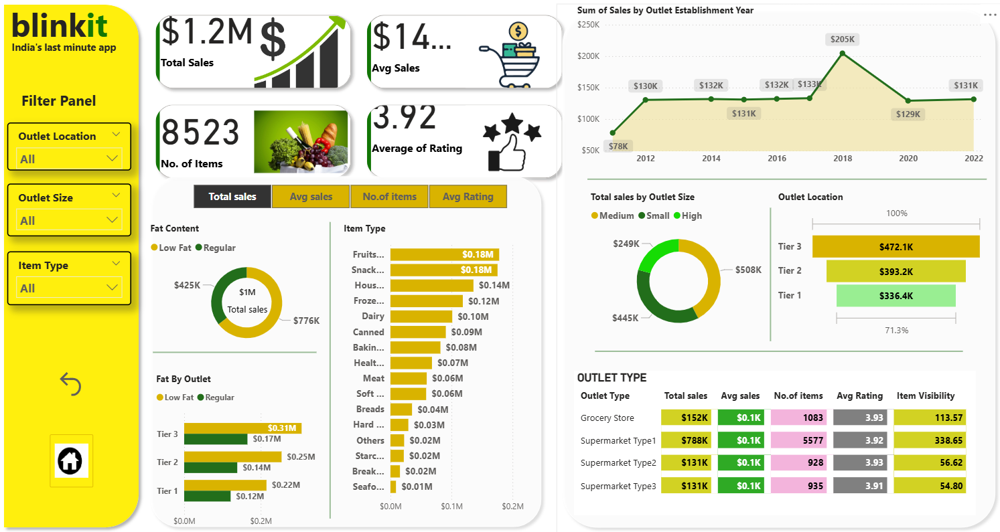

# 🛒 BlinkIt Sales Dashboard

---

## 📸 Dashboard Preview

---

## 📌 Overview

The **BlinkIt Sales Dashboard** provides insights into sales performance across multiple outlets. It helps analyze how outlet characteristics and item types impact overall business performance.

---

## 🚀 Features

* **Total Sales** – Overall revenue across outlets
* **Average Sales** – Mean sales performance
* **Number of Items** – Total items sold
* **Average Rating** – Customer satisfaction indicator

---

## 📊 Visualizations

* **Donut Chart** – Distribution by fat content
* **Funnel Chart** – Sales by outlet location
* **Matrix** – Performance by outlet type

---

## 🎛️ Filters (Slicers)

* Outlet Location
* Outlet Size
* Item Type

---

## 📂 Data Source

Dataset includes outlet details, item types, sales data, and customer ratings for analysis.

---

## ⚙️ Requirements

* Power BI Desktop (May 2024 or later)

---

## 🧑‍💻 Usage

1. Open the `.pbix` file in Power BI
2. Use slicers to filter data
3. Interact with visuals for insights

---

## 💡 Insights

* Fat content distribution shows product mix
* Location funnel highlights sales concentration
* Matrix identifies top-performing outlet types

---

## 🔮 Future Enhancements

* Add time-based trends (monthly/yearly)
* Include customer demographic insights

---
